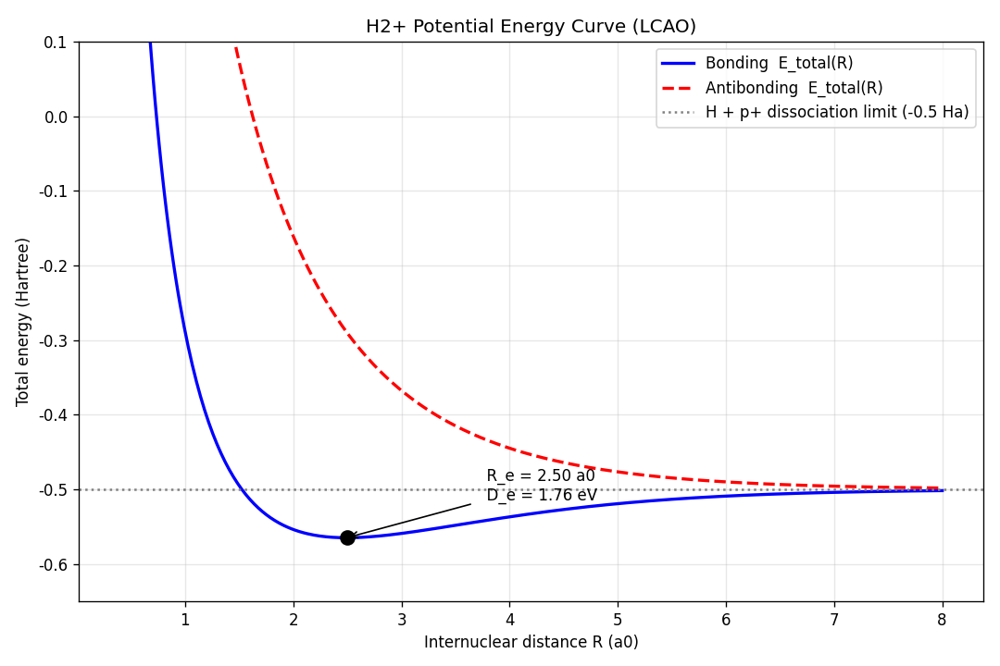
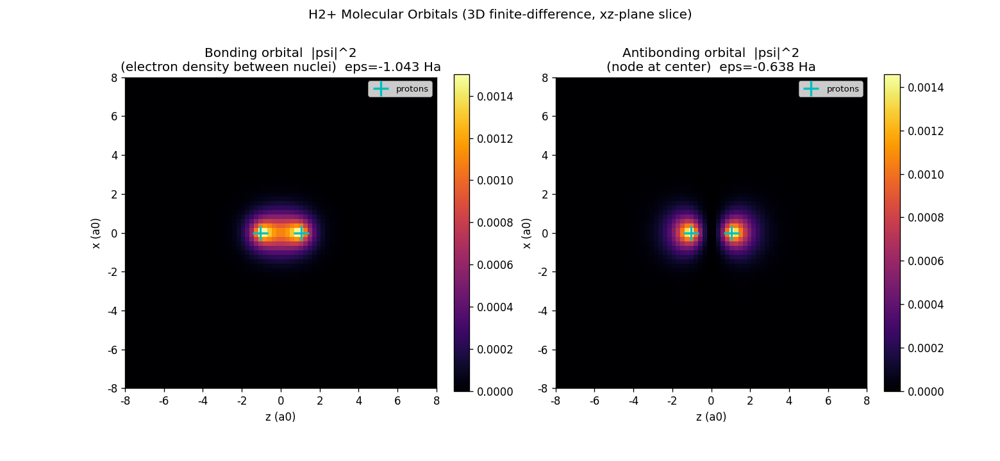
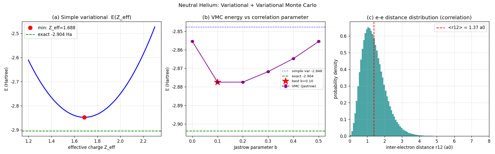

# Week 11: 양자역학 시뮬레이션 + AI for Science 강의 정리 — 제출

| 항목 | 내용 |
|------|------|
| 학과 | 물리학과 |
| 이름 | 최상현 |
| 학번 | 202312162 |
| 저장소 | https://github.com/shchoi2612/AI-ML |

---

## 1부. AI for Science 강의 요약 (Chris Bishop, Microsoft Technical Fellow)

Microsoft의 기술 펠로우 **크리스 비숍(Chris Bishop)** 박사가 과학적 난제 해결을 위해
AI와 딥러닝을 어떻게 활용하는지 설명한 강의를 시청하고 정리하였다.

### 핵심 메시지

**① 과학의 근본과 계산의 한계 (1:45, 3:20)**
- 우리 세계는 수학적으로 정확하게 기술된다(슈뢰딩거 방정식 등 기본 법칙은 이미 알려져 있음).
- 그러나 이를 직접 푸는 **시뮬레이션은 계산 비용이 매우 커서**, 복잡한 분자나 물질을
  연구하는 데 근본적인 한계가 있다.

**② AI 에뮬레이터(Emulator) 도입 (7:25)**
- 무거운 시뮬레이터를 매번 직접 실행하는 대신, **시뮬레이션 데이터를 학습한 AI 에뮬레이터**를
  사용한다.
- 기존 방법보다 **수천 배 빠르게** 결과를 도출하는 새로운 경로를 제안.

**③ 학습 데이터와 물리 법칙 (8:09 – 11:20)**
- **No Free Lunch 정리**를 언급: 아무 가정 없는 순수 데이터 학습만으로는 한계가 있다.
- 따라서 **슈뢰딩거 방정식 같은 물리적 유도 편향(Inductive Bias)** 을 모델 구조에
  통합하는 것이 중요하다. → 물리를 아는 모델이 더 적은 데이터로 더 잘 일반화한다.

**④ 적용 사례**
- **기상 예측 (21:35)**: 기상 데이터를 학습한 **파운데이션 모델**로 오염 물질 확산 예측 등
  다양한 환경 문제에 대응.
- **재료·분자 과학 (23:25, 37:42)**: **MatterGen**으로 신소재 생성, **Skala**로
  밀도 범함수 이론(DFT)을 개선하여 화학적 정확도(chemical accuracy) 달성 시도.
- **생물학·단백질 (43:50)**: 복잡한 생체 분자의 **동역학(Dynamics)** 을 시뮬레이션하여
  단백질 접힘 같은 문제 해결 노력.

### 결론
AI 에뮬레이터는 **과학적 발견의 속도를 획기적으로 가속**하고, **실험 데이터와 시뮬레이션
사이의 간극을 메우는** 강력한 도구가 될 것이다.

### 이번 주차 과제와의 연결
강의가 강조한 "물리 법칙(슈뢰딩거 방정식)을 모델에 통합한다"는 아이디어의 **출발점**은,
바로 슈뢰딩거 방정식을 **직접 수치적으로 푸는 것**이다. 이번 week11 과제(아래 2부)에서
H₂⁺·He에 대해 슈뢰딩거 방정식을 직접 푼 경험은, 강의가 말한 "AI 에뮬레이터가 대체하려는
바로 그 비싼 시뮬레이션"이 무엇인지, 그리고 왜 물리적 귀납 편향이 중요한지를 체감하게 해 준다.

---

## 2부. Week11 양자역학 문제 풀이

슈뢰딩거 방정식을 수치적으로 풀어 **H₂⁺ 분자 이온의 전자 파동함수**와
**중성 He(전자 2개)의 다체 문제**를 다루었다. 원자 단위(ℏ = mₑ = e = 1) 사용.

> - 원본 문제: [`week11_problem.md`](week11_problem.md)
> - 풀이 접근법 상세: [`solution_approach.md`](solution_approach.md)

### 문제 ①②: H₂⁺ 전자 파동함수 — `05_h2plus.py`

Born-Oppenheimer 근사로 양성자 2개를 거리 R에 고정하고 전자의 슈뢰딩거 방정식을 풀었다.

```
Ĥ = -½∇² - 1/r_A - 1/r_B,   E_total(R) = ε(R) + 1/R
```

**(A) LCAO 변분법** — 1s 두 개의 선형결합으로 2×2 일반화 고유값 문제:

| 양 | 결과 | 비고 |
|---|---|---|
| 평형 결합길이 R_e | **2.50 a₀ (1.32 Å)** | 정확값 2.0 a₀ (ζ=1 단순 LCAO라 과대평가) |
| 해리에너지 D_e | **1.76 eV** | 정확값 2.79 eV |

**(B) 3D 유한차분 (70³ 격자, 희소행렬 + `eigsh`)** — 실제 분자 오비탈:

| 상태 | 전자에너지 ε |
|---|---|
| 결합(bonding) | **−1.043 Ha** (정확값 −1.10 Ha 근사) |
| 반결합(antibonding) | −0.638 Ha |




→ **결합 오비탈**은 두 핵 사이에 전자밀도가 집중되어 결합을 형성하고,
**반결합 오비탈**은 중앙에 노드(node)가 생긴다. (교과서 그림 재현)

### 문제 ③: 중성 He 다체 문제 — `06_helium.py`

He⁺(전자 1개)와 달리 중성 He는 전자-전자 반발항 `1/r₁₂` 때문에 파동함수가 6차원이고
변수분리가 안 되는 다체 문제다. 격자법 대신 **변분법 + 변분 몬테카를로(VMC)** 로 풀었다.

```
Ĥ = -½∇₁² - ½∇₂² - 2/r₁ - 2/r₂ + 1/r₁₂
```

| 방법 | E (Hartree) | E (eV) |
|---|---|---|
| Z=2 (가림 무시) | −2.750 | −74.83 |
| 변분법 (Z_eff = 27/16 = 1.6875) | −2.848 | −77.49 |
| **VMC (Jastrow, b=0.1, Metropolis)** | **−2.878 ± 0.0003** | **−78.30** |
| 정확값 (실험/이론) | −2.904 | −79.01 |

- 첫 이온화에너지: **23.9 eV** (실험값 24.59 eV)
- Jastrow 상관인자 + Metropolis 샘플링(수락률 ~37%)으로 **전자 상관**을 포함하여
  단순 변분(−2.85)보다 정확값(−2.90)에 더 접근.



→ `1/r₁₂` 비분리항 때문에 격자 유한차분 대신 **몬테카를로**가 필요함을 실증.
이것이 바로 1부 강의가 말한 "비싼 다체 시뮬레이션"의 한 예다.

---

## 실행 방법

```bash
cd week11
uv run python 05_h2plus.py      # H2+ : 에너지 곡선 + 분자 오비탈
uv run python 06_helium.py      # He  : 변분법 + 변분 몬테카를로
# 결과 그림은 outputs/ 에 저장됨
```

## 파일 구성

| 파일 | 설명 |
|---|---|
| `README.md` | 이 문서 (강의 요약 + 풀이 결과 + 제출 정보) |
| `plan.md` | 제출 작업 계획 |
| `05_h2plus.py` | H₂⁺ 전자 파동함수 풀이 코드 |
| `06_helium.py` | 중성 He 다체 문제 풀이 코드 |
| `solution_approach.md` | 풀이 접근법 상세 설명 |
| `week11_problem.md` | 원본 문제(강의자료) |
| `outputs/` | 결과 그림 3장 |
