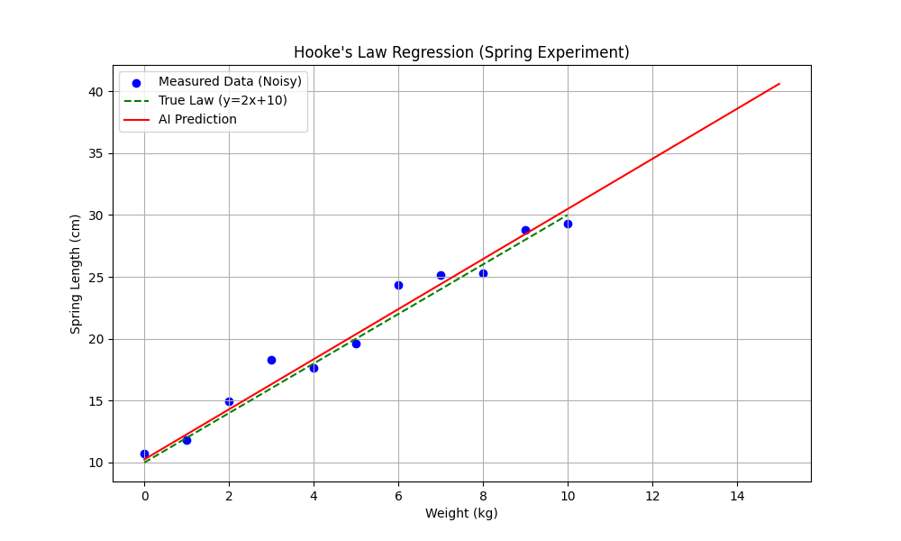
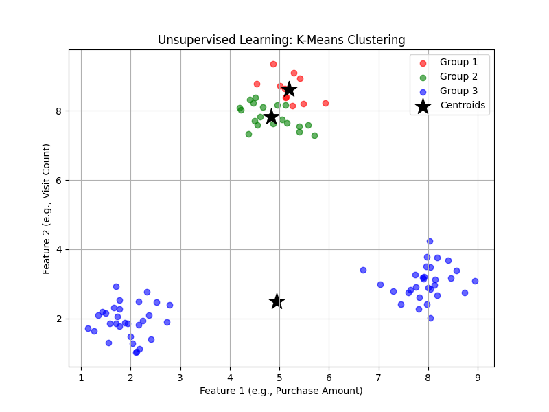
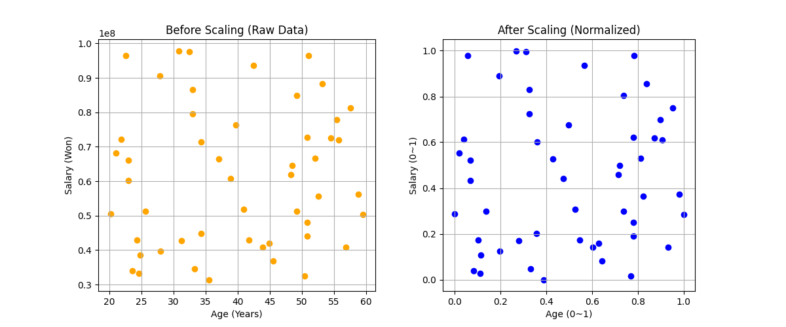
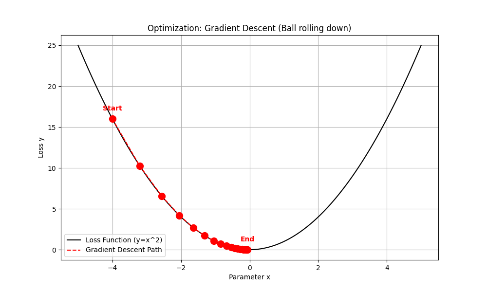
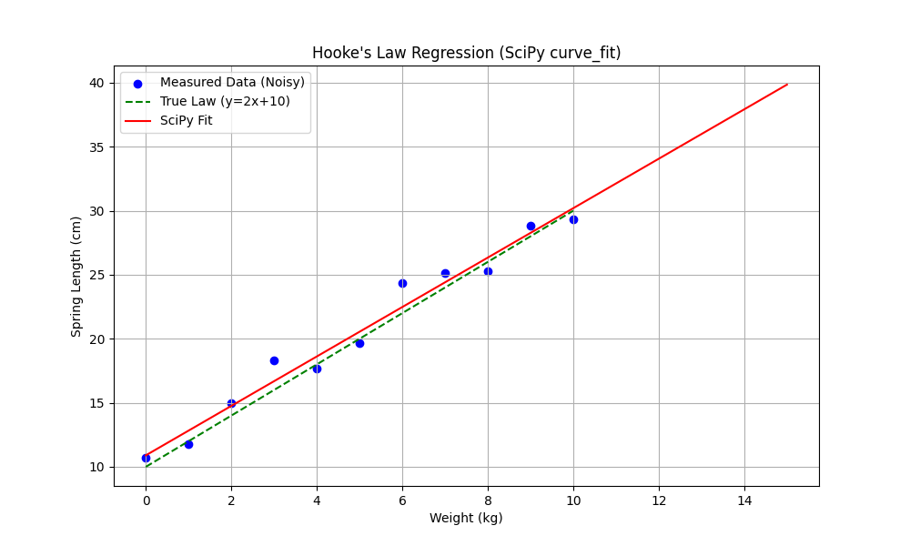
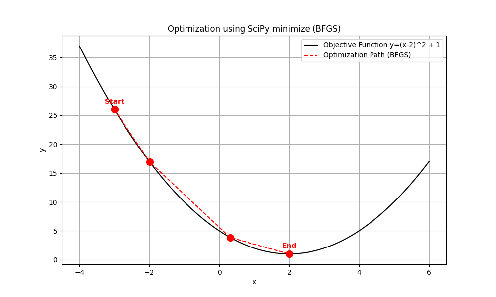

# Week 2 실행 결과 요약

**작성자:** 최상현 (202312162, 물리학과)

## 실행 환경

- Python 3.12.3
- TensorFlow 2.21.0
- NumPy, SciPy, Matplotlib
- 실행 방법: `uv sync` → `uv run <script>`

---

## 01. 선형 회귀 — 용수철 실험 (`01_linear_regression_spring.py`)

**목적:** 훅의 법칙(`길이 = 2 × 무게 + 10`)을 TensorFlow 신경망으로 학습

**실행 결과:**
```
[학습 결과]
예측된 식: 길이 = 2.02 × 무게 + 10.26
실제 식  : 길이 = 2.00 × 무게 + 10.00

[예측 테스트]
15kg → 예측: 40.59 cm / 이론값: 40.00 cm
```

**결과 그래프:**



---

## 02. 비지도 학습 — K-Means 군집화 (`02_unsupervised_clustering.py`)

**목적:** 정답 없이 90개 데이터를 K=3으로 자동 분류

**실행 결과:**
```
[학습 완료된 중심점]
Group 1: (5.20, 8.63)
Group 2: (4.83, 7.84)
Group 3: (4.94, 2.48)
```

**결과 그래프:**



---

## 03. 데이터 전처리 — Min-Max 정규화 (`03_data_preprocessing.py`)

**목적:** 스케일이 다른 연봉(3천만~1억)과 나이(20~59)를 0~1 범위로 통일

**실행 결과:**
```
연봉(원본): 최소 31,440,915 / 최대 97,893,690
연봉(변환): 최소 0.0 / 최대 1.0
나이(원본): 최소 20 / 최대 59
나이(변환): 최소 0.0 / 최대 1.0
```

**결과 그래프:**



---

## 04. 최적화 — 경사 하강법 시각화 (`04_gradient_descent_vis.py`)

**목적:** 손실 함수 `f(x) = x²` 에서 Gradient Descent로 최솟값 탐색 (시작: x = -4.0)

**실행 결과:**
```
Step  1: x = -3.2000, Loss = 16.0000
Step  5: x = -1.3107, Loss =  2.6844
Step 10: x = -0.4295, Loss =  0.2882
Step 20: x = -0.0461, Loss =  0.0033  ← 목표값 0.0에 근접
```

**결과 그래프:**



---

## 05. SciPy 비교 (ex/)

### 5-1. SciPy 선형 회귀 (`ex/01_spring_scipy.py`)

```
예측된 식: 길이 = 1.93 × 무게 + 10.90
15kg → 예측: 39.85 cm
```



### 5-2. SciPy BFGS 최적화 (`ex/04_optimization_scipy.py`)

```
최적의 x: 2.0000 / 최소값 y: 1.0000
반복 횟수: 단 3회 (Gradient Descent 20회 대비)
```



---

## TensorFlow vs SciPy 비교

| 항목 | TensorFlow (SGD) | SciPy (BFGS) |
|------|-----------------|--------------|
| 접근 방식 | 반복 최적화 (500 epochs) | 수학적 수치해법 (3회) |
| 속도 | 느림 | 빠름 |
| 확장성 | 신경망 전체 가능 | 단순 모델만 |
| 결과 정확도 | 거의 동일 | 거의 동일 |

---

## 핵심 개념 요약

| 개념 | 설명 |
|------|------|
| 지도 학습 | 입력 + 정답 → AI가 규칙 학습 |
| 비지도 학습 | 입력만 → AI가 스스로 패턴 발견 |
| 정규화 | 스케일 통일 → `(x - min) / (max - min)` |
| 손실 함수 | 예측과 실제의 차이 → MSE |
| 경사 하강법 | `x_new = x_old - α × gradient` |
| Epoch | 전체 데이터 1회 학습 |
