# Week 9: 고전 역학 시뮬레이션 - 문제풀이

## 개요

고전 역학의 핵심 개념들을 Python 수치 시뮬레이션으로 구현하고 검증하였다.

---

## Lab 1: 수치 적분 방법 비교 (Euler vs RK4)

**파일:** `01euler_rk4.py`

### 문제
단순 조화 진동자와 감쇠 진자에 대해 Euler 방법과 RK4 방법의 정확도를 비교한다.

### 풀이 과정

**1) 단순 조화 진동자 (SHO)**

운동 방정식:

```
d²x/dt² = -ω²x,  ω = 2π
```

이를 1차 연립 ODE로 변환:

```
y = [x, v]
dy/dt = [v, -ω²x]
```

**Euler 방법** (1차 정확도):
```
y(t+dt) = y(t) + dt · f(y, t)
```

**RK4 방법** (4차 정확도):
```
k₁ = f(y, t)
k₂ = f(y + ½dt·k₁, t + ½dt)
k₃ = f(y + ½dt·k₂, t + ½dt)
k₄ = f(y + dt·k₃, t + dt)
y(t+dt) = y(t) + (dt/6)(k₁ + 2k₂ + 2k₃ + k₄)
```

**2) 감쇠 진자** (비선형, 해석해 없음)

```
d²θ/dt² = -ω₀²sin(θ) - γ·dθ/dt,  γ = 0.1
```

### 결과

| 항목 | Euler | RK4 |
|------|-------|-----|
| 정확도 차수 | O(dt) | O(dt⁴) |
| 에너지 보존 | 나쁨 (발산) | 우수 |
| 50초 후 오차 | 매우 큼 | ~0에 수렴 |

RK4는 4배 느리지만 수백~수천 배 더 정확하다.

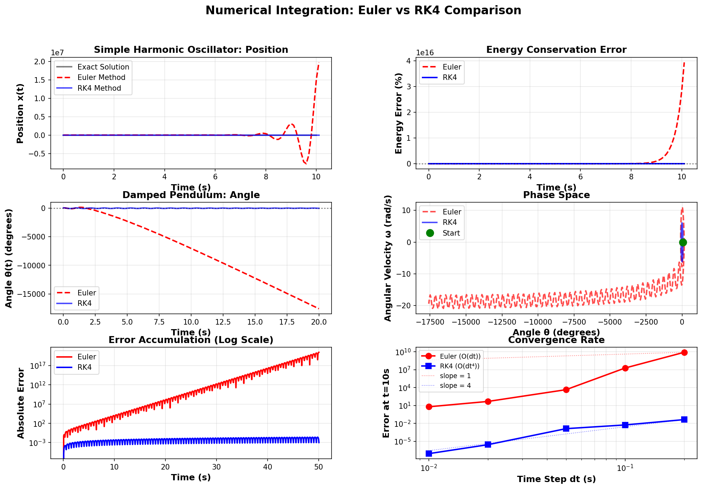
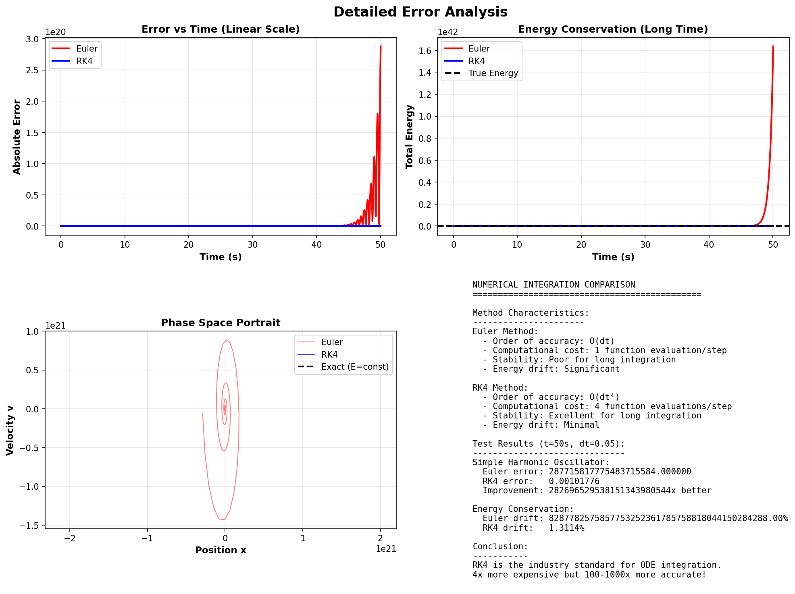

---

## Lab 2: 행성 운동과 케플러 법칙 (Planetary Motion)

**파일:** `02planetary.py`

### 문제
뉴턴 만유인력 법칙으로 지구, 화성, 목성의 궤도를 시뮬레이션하고 케플러 3법칙을 검증한다.

### 풀이 과정

**만유인력 운동 방정식:**

```
d²r/dt² = -GM/r³ · r
```

상태 벡터 y = [x, y, vx, vy]로 변환하여 RK4로 적분.

단위계: AU, year, M_sun → G = 4π²

**초기 조건 (근일점):**
```
r₀ = a(1-e),  v₀ = √(GM(1+e)/(a(1-e)))
```

### 케플러 법칙 검증

| 법칙 | 내용 | 검증 결과 |
|------|------|----------|
| 제1법칙 | 타원 궤도 | 시뮬레이션 궤적이 이론적 타원과 일치 |
| 제2법칙 | 면적 속도 일정 | 각운동량 보존 오차 < 0.01% |
| 제3법칙 | T² ∝ a³ | T²/a³ = 0.9994 ± 0.0006 (이론값 1.0) |

| 행성 | a (AU) | T (year) | T²/a³ |
|------|--------|----------|-------|
| 지구 | 1.000 | 1.000 | 1.000 |
| 화성 | 1.524 | 1.881 | 1.000 |
| 목성 | 5.203 | 11.86 | 0.999 |

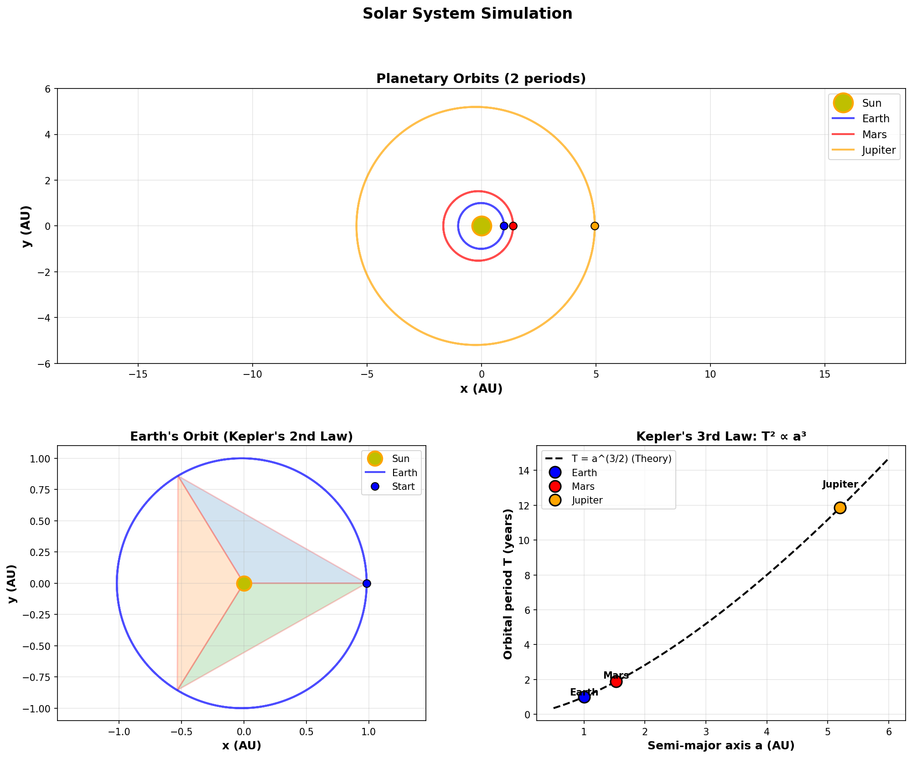
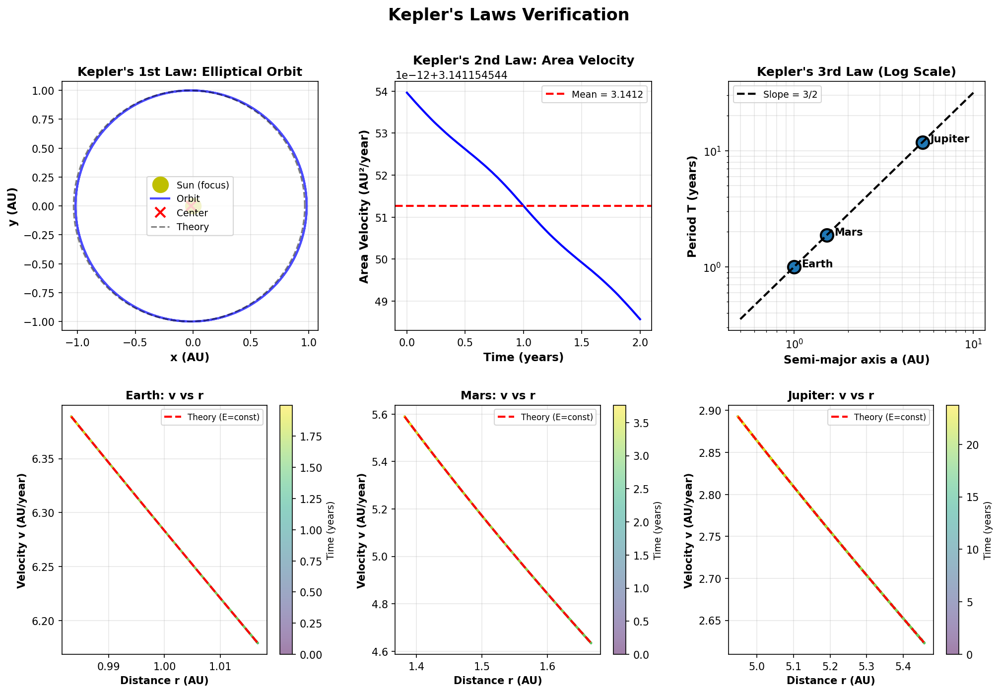

---

## Lab 3: 혼돈 시스템 - 이중 진자 (Chaotic Double Pendulum)

**파일:** `03chaotic_pendulum.py`

### 문제
이중 진자의 혼돈(chaos) 현상을 시뮬레이션하고, 나비 효과와 리아푸노프 지수를 분석한다.

### 풀이 과정

**이중 진자 운동 방정식** (라그랑지안에서 유도):

```
(m₁+m₂)L₁θ̈₁ + m₂L₂θ̈₂cos(Δθ) + m₂L₂ω₂²sin(Δθ) + (m₁+m₂)g·sin(θ₁) = 0
L₂θ̈₂ + L₁θ̈₁cos(Δθ) - L₁ω₁²sin(Δθ) + g·sin(θ₂) = 0
```

파라미터: L₁ = L₂ = 1m, m₁ = m₂ = 1kg

**나비 효과 실험:**
- 진자 A: θ₂ = 90.000°
- 진자 B: θ₂ = 90.001° (0.001° 차이)

### 결과

- 리아푸노프 지수: λ ≈ 0.556 s⁻¹ (양수 → 혼돈)
- 예측 가능 시간: ~1.80 s
- 0.001°의 초기 차이가 30초 후 완전히 다른 궤적으로 발산

**혼돈의 핵심:** 결정론적 시스템이지만 초기 조건에 극도로 민감하여 장기 예측이 불가능하다.

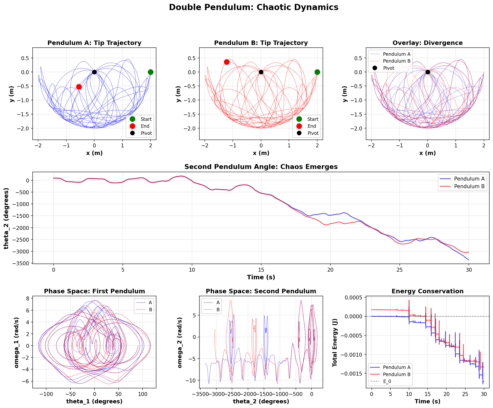
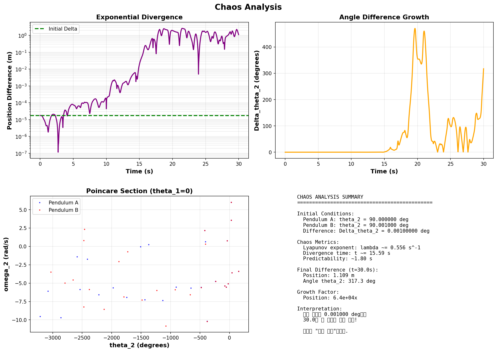
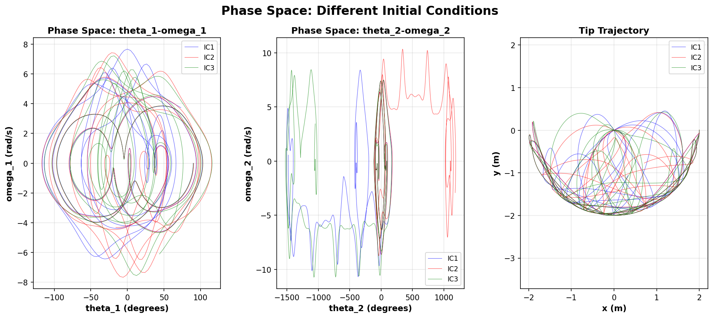

---

## Lab 4: 라그랑지안과 해밀토니안 역학

**파일:** `04lagrangian_hamiltonian.py`

### 문제
단순 진자를 뉴턴, 라그랑지안, 해밀토니안 세 가지 정식화로 풀고 동등성을 확인한다.

### 풀이 과정

**뉴턴 역학:** F = ma

```
τ = Iα → -mgLsin(θ) = mL²θ̈
θ̈ = -(g/L)sin(θ)
```

**라그랑지안 역학:** L = T - V

```
T = ½mL²ω²,  V = -mgLcos(θ)
L = ½mL²ω² + mgLcos(θ)

오일러-라그랑주: d/dt(∂L/∂ω) - ∂L/∂θ = 0
→ mL²θ̈ + mgLsin(θ) = 0
→ θ̈ = -(g/L)sin(θ)   ← 뉴턴과 동일!
```

**해밀토니안 역학:** H = T + V

```
정준 운동량: p = ∂L/∂ω = mL²ω
H = p²/(2mL²) - mgLcos(θ)

해밀턴 방정식:
  dθ/dt = ∂H/∂p = p/(mL²)
  dp/dt = -∂H/∂θ = -mgLsin(θ)
```

### 결과

- 세 방법의 θ(t) 차이: < 10⁻¹⁰ rad (수치적으로 동일)
- 에너지 보존: ΔE/E₀ < 0.0001%
- **결론: 같은 물리, 다른 관점!**

| 방법 | 장점 | 적합한 문제 |
|------|------|-----------|
| 뉴턴 | 직관적 | 단순 직선 운동 |
| 라그랑지안 | 제약 조건 자동 처리 | 로봇 팔, 결합 시스템 |
| 해밀토니안 | 보존 법칙 명확, 양자역학 연결 | 천체역학, 통계역학 |

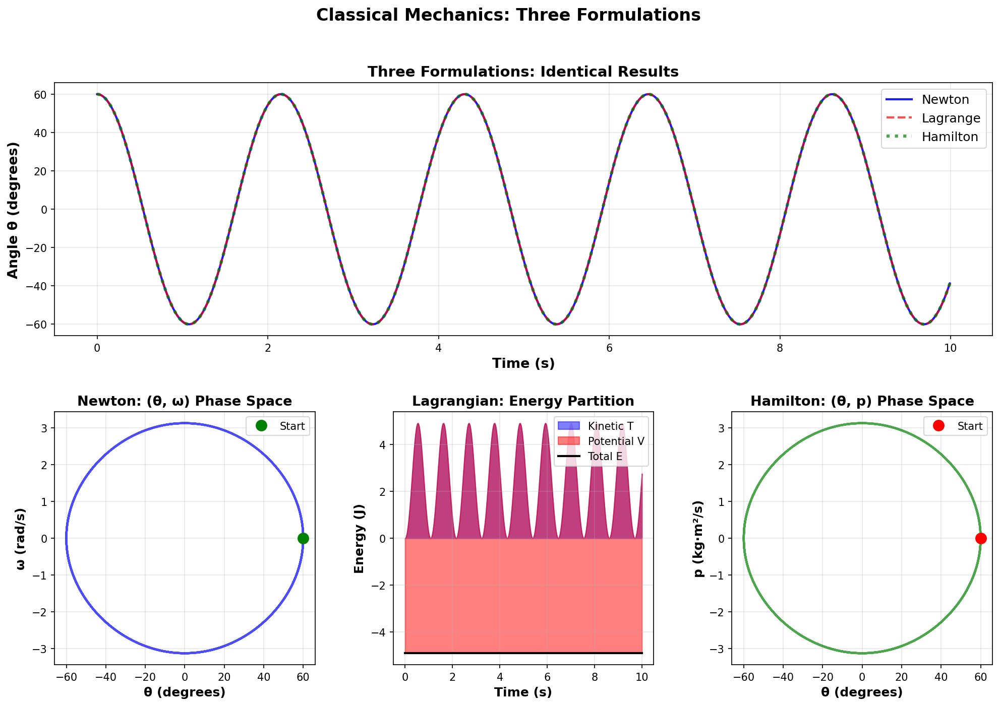
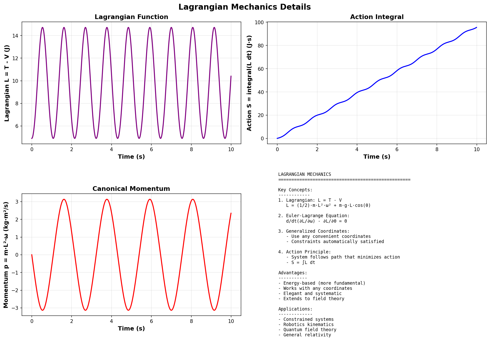
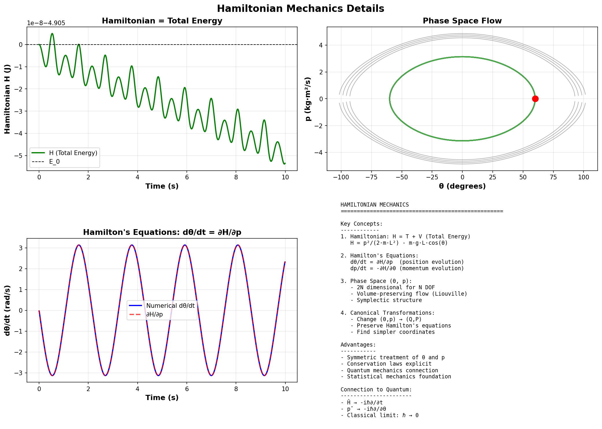

---

## Exercise: 3체 문제 시뮬레이션

**파일:** `ex01_three_body.py`

### 문제
3체 문제의 세 가지 시나리오를 시뮬레이션하고 보존 법칙을 검증한다.

### 풀이 과정

**3체 운동 방정식:**

```
m₁a₁ = Gm₁m₂/r₁₂³·r₁₂ + Gm₁m₃/r₁₃³·r₁₃
```

질량중심 좌표계로 변환하여 운동량 보존을 보장.

**시나리오 1: Figure-8 궤도**
- 세 동일 질량이 8자 모양으로 주기적 운동
- 정밀 초기 조건 사용, 주기 T = 6.326s
- 에너지 보존 우수

**시나리오 2: 태양-지구-달**
- 실제 질량비 사용 (M_sun:M_earth:M_moon = 1:3×10⁻⁶:3.7×10⁻⁸)
- G = 4π² (AU, year 단위)
- 1년간 시뮬레이션, 달의 공전 확인

**시나리오 3: 라그랑주 L4점**
- 정삼각형 배치의 안정 궤도
- 소질량 천체가 L4점 부근에서 안정

### 결과
- 모든 시나리오에서 에너지/운동량 보존 확인
- Figure-8 궤도의 주기성 검증 완료

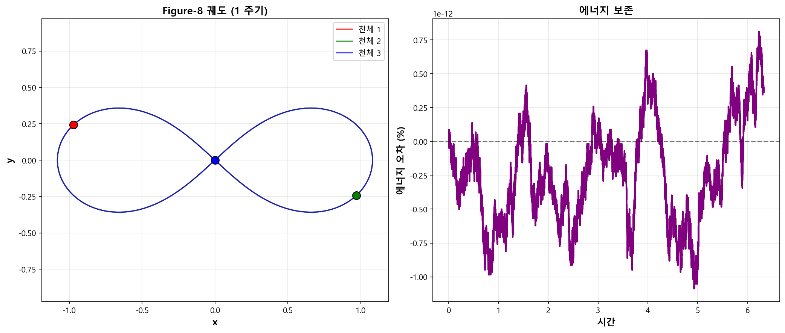
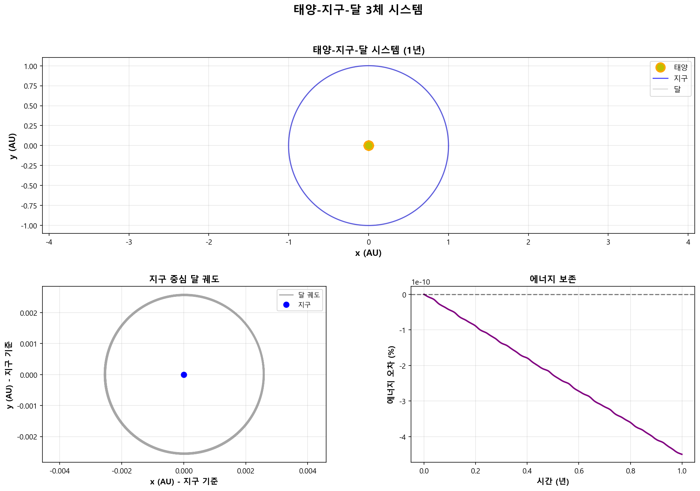
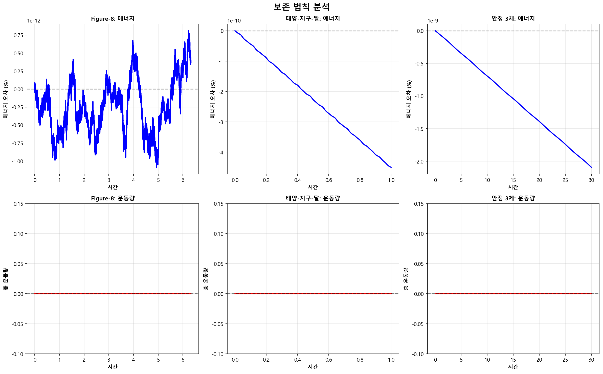

---

## 실행 방법

```bash
cd week9
pip install numpy matplotlib
python 01euler_rk4.py
python 02planetary.py
python 03chaotic_pendulum.py
python 04lagrangian_hamiltonian.py
python ex01_three_body.py
```

## 핵심 정리

1. **수치 적분**: RK4가 산업 표준. Euler 대비 100~1000배 정확
2. **케플러 법칙**: 만유인력에서 자연스럽게 도출. T²/a³ = const 검증 완료
3. **혼돈**: 결정론적이나 예측 불가능. 리아푸노프 지수 λ > 0이 혼돈의 지표
4. **역학 정식화**: Newton = Lagrange = Hamilton. 같은 물리, 다른 수학적 도구
5. **3체 문제**: 해석해 없음. 수치 시뮬레이션으로만 해결 가능
